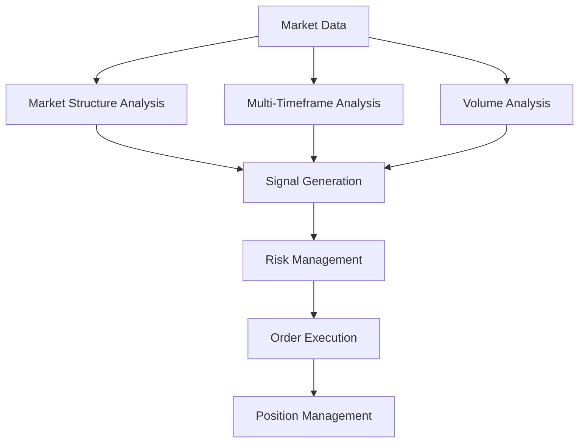

# Core System Architecture

## Overview
The trading bot is built with a modular architecture, consisting of several specialized components that work together to analyze markets and execute trades.

## Core Components

### 1. TradingBot
The main class that orchestrates all components and manages the trading lifecycle.
- Initializes all components
- Manages MT5 connection
- Coordinates market analysis
- Handles trade execution
- Updates dashboard
- Manages error handling and logging

### 2. Analysis Components

#### SignalGenerator
Central component that combines analyses from multiple specialized analyzers:
- Calculates technical indicators
- Coordinates analysis from sub-components
- Generates final trading signals
- Manages weighted scoring system

#### SMCAnalysis
Smart Money Concepts analyzer:
- Liquidity sweep detection
- Order block identification
- Manipulation point detection
- Premium/discount zones
- Order flow analysis

#### MTFAnalysis
Multi-timeframe analyzer:
- Trend alignment across timeframes
- Structure alignment
- Momentum alignment
- Confluent level detection

#### DivergenceAnalysis
Divergence detection system:
- Regular divergences
- Hidden divergences
- Structural divergences
- Momentum divergences

#### VolumeAnalysis
Volume-based analysis:
- Volume Profile
- Cumulative Delta
- Support/resistance levels
- Smart money patterns

### 3. Risk Management
RiskManager class handling:
- Position sizing
- Stop loss calculation
- Take profit levels
- Risk per trade
- Daily risk limits
- Session-specific rules

### 4. Integration Components

#### MT5Handler
MetaTrader 5 integration:
- Market data retrieval
- Order execution
- Position management
- Account information

#### TelegramBot
Communication system:
- Trade alerts
- Error notifications
- Status updates
- Command handling

#### Dashboard
Web-based monitoring:
- Real-time status
- Trading signals
- Active positions
- Performance metrics

### 5. Support Systems

#### AIAnalyzer
Artificial Intelligence integration:
- Sentiment analysis
- Pattern recognition
- Market bias detection

#### Configuration
Flexible configuration system:
- Trading parameters
- Risk settings
- Session rules
- Integration settings

## Market Analysis Components

### 1. Market Structure Analysis
The market structure analysis has been enhanced with the following components:

#### Order Block Detection
- Dynamic threshold calculation based on volatility
- Strength scoring system for order blocks
- Filtering mechanism for high-probability setups
- Integration with price action confirmation

#### Structure Break Analysis
- Enhanced break detection algorithm
- Strength measurement for structure breaks
- Trend continuation validation
- Integration with multi-timeframe confirmation

#### Fair Value Gap Analysis
- Dynamic gap threshold calculation
- Quality scoring system
- Time-based decay factor
- Volume confirmation integration

### 2. Multi-Timeframe Analysis

#### Timeframe Hierarchy
- Primary: Trading timeframe (M5, M15, H1, H4)
- Secondary: Next higher timeframe
- Tertiary: Two timeframes higher
- Reference: Daily timeframe

#### Alignment Scoring
- Dynamic weight distribution
- Confidence factor calculation
- Bias strength measurement
- Trend continuation probability

### 3. Signal Generation

#### Component Integration
```
Market Structure (45%)
  ├── Order Blocks
  ├── Structure Breaks
  └── Fair Value Gaps

Volume Analysis (25%)
  ├── Volume Profile
  ├── Delta Volume
  └── Volume Imbalance

Smart Money Concepts (20%)
  ├── Liquidity Voids
  ├── Inefficient Price Movement
  └── Institutional Interest

Multi-Timeframe (10%)
  ├── Trend Alignment
  ├── Structure Alignment
  └── Momentum Alignment
```

#### Signal Validation
- Minimum 2 confirmations required
- Dynamic threshold adjustment
- Timeframe-specific validation rules
- Currency pair specific requirements

### 4. Risk Management

#### Position Sizing
- Volatility-adjusted sizing
- Account balance consideration
- Maximum position limits
- Currency pair risk factors

#### Stop Loss Calculation
- Dynamic ATR multipliers
- Market structure integration
- Volatility-based adjustment
- Minimum distance requirements

## System Flow



## Data Flow

### 1. Data Collection
- Real-time price data from MT5
- Historical data caching
- Volume profile aggregation
- Market structure mapping

### 2. Analysis Pipeline
- Market structure detection
- Multi-timeframe alignment
- Volume analysis integration
- Signal score calculation

### 3. Execution Flow
- Signal validation
- Risk calculation
- Order placement
- Position monitoring

## Configuration Management

### 1. Timeframe Settings
```python
TIMEFRAME_SETTINGS = {
    'M5': {
        'base_score': 0.75,
        'ranging_market': 0.4,
        'trending_market': 0.8,
        'volatility_filter': 1.2,
        'min_trend_strength': 0.65
    },
    'M15': {
        'base_score': 0.65,
        'ranging_market': 0.35,
        'trending_market': 0.75,
        'volatility_filter': 1.3,
        'min_trend_strength': 0.6
    },
    # ... other timeframes
}
```

### 2. Component Weights
```python
COMPONENT_WEIGHTS = {
    'M5': {
        'structure': 0.45,
        'volume': 0.25,
        'smc': 0.20,
        'mtf': 0.10
    },
    # ... other timeframes
}
```

### 3. Currency Pair Settings
```python
PAIR_SETTINGS = {
    'EURUSD': {
        'multiplier': 1.00,
        'volatility_threshold': 1.5,
        'min_range': 0.0010
    },
    # ... other pairs
}
```

## Performance Optimization

### 1. Data Management
- Efficient data caching
- Optimized calculations
- Memory usage optimization
- Thread management

### 2. Analysis Optimization
- Parallel processing
- Calculation reuse
- Selective update
- Resource management

### 3. Execution Optimization
- Queue management
- Priority handling
- Error recovery
- State management

## Error Handling

- Comprehensive try-except blocks
- Graceful degradation
- Automatic reconnection
- Alert system
- Detailed logging

## Performance Considerations

- Asynchronous operations
- Efficient data processing
- Memory management
- Connection pooling
- Rate limiting

## Security

- API key management
- Secure communications
- Access controls
- Error masking
- Audit logging

## Technologies and Libraries
- **Programming Language**: Python
- **MT5 Integration**: `MetaTrader5` library
- **Telegram Bot**: `python-telegram-bot` library
- **Database**: SQLite
- **AI Integration**: OpenAI GPT or `NewsAPI`
- **Logging**: `Loguru`
- **Monitoring**: `Flask` or `Dash`

---

## Deployment
The bot will run on a local Windows machine. Ensure Python and all required libraries are installed. Use a task scheduler (e.g., Windows Task Scheduler) to run the bot automatically at startup.