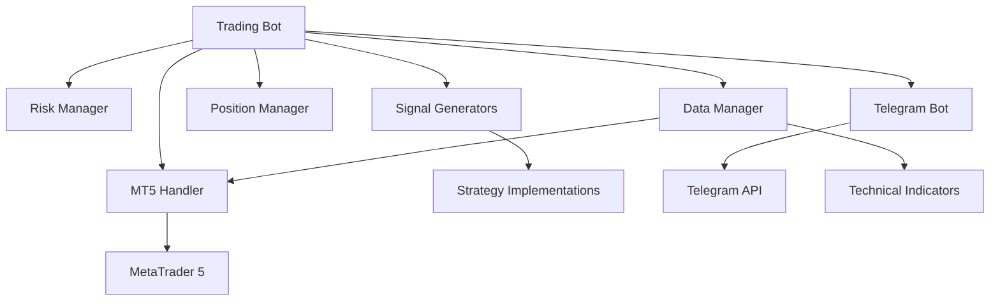
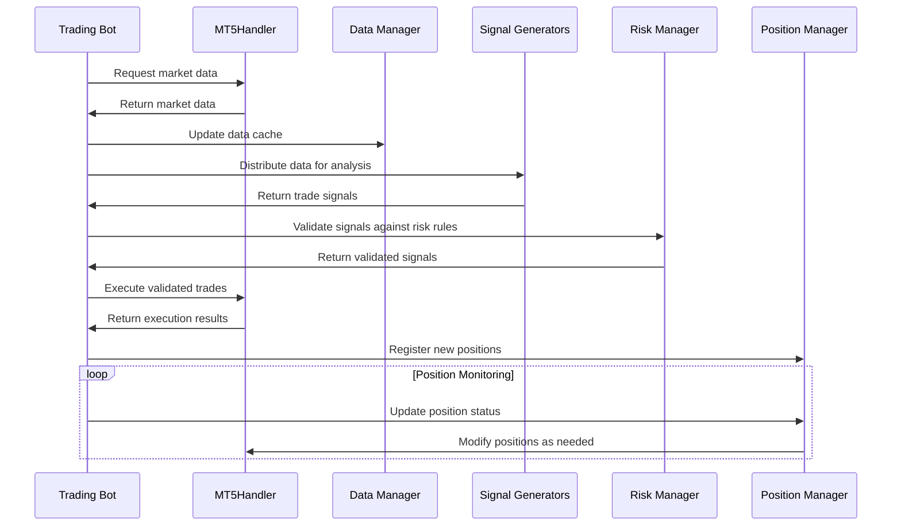
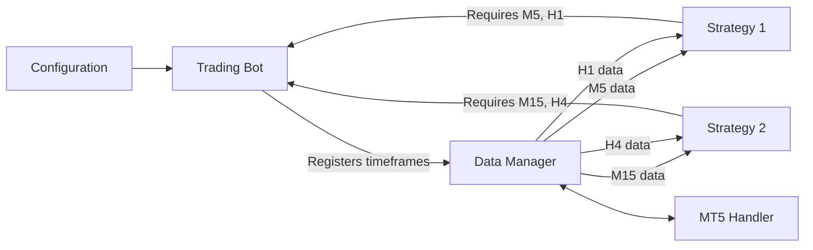

# System Patterns

## Architecture Overview
The Trading Bot is designed using a modular architecture that separates concerns across specialized components. The system follows several well-established architectural patterns to ensure flexibility, maintainability, and extensibility.



## Key Design Patterns

### 1. Singleton Pattern
- **Implementation**: The MT5Handler uses a singleton pattern to ensure only one connection to MetaTrader 5 exists.
- **Benefits**: Prevents duplicate connections, centralizes communication with MT5, simplifies resource management.
- **Example**: `MT5Handler.get_instance()` returns the single instance.

### 2. Observer Pattern
- **Implementation**: Real-time data monitoring uses callbacks to notify subscribers of market changes.
- **Benefits**: Decouples market data acquisition from processing logic, allows multiple components to react to the same events.
- **Example**: The RealTimeDataCallback class implements callbacks for ticks and new candles.

### 3. Strategy Pattern
- **Implementation**: Trading strategies are implemented as separate classes inheriting from a base SignalGenerator.
- **Benefits**: New strategies can be added without modifying existing code, strategies can be swapped at runtime.
- **Example**: Different strategy implementations in the /src/strategy directory.

### 4. Factory Pattern
- **Implementation**: Strategy creation is managed through a factory that instantiates the appropriate strategy based on configuration.
- **Benefits**: Centralizes strategy creation, simplifies configuration, abstracts instantiation details.
- **Example**: Strategy loading mechanism in the TradingBot class.

### 5. Command Pattern
- **Implementation**: Telegram commands are handled through a command processor that maps commands to actions.
- **Benefits**: Decouples command interpretation from execution, simplifies adding new commands.
- **Example**: Telegram command handler processing user inputs.

## Component Relationships

### Trading Bot (Orchestrator)
- Central coordinator that manages the workflow and interactions between components
- Maintains state of the trading system and handles the main execution loop
- Acts as a facade for external communication

### MT5Handler
- Abstracts all communication with MetaTrader 5
- Provides methods for market data fetching, trade execution, position management
- Implements connection management and error handling for MT5 operations

### Risk Manager
- Validates potential trades against risk parameters
- Calculates appropriate position sizes based on account equity and risk percentage
- Enforces risk limits and drawdown controls

### Signal Generators
- Encapsulate trading strategies and analysis logic
- Define their own timeframe requirements
- Process market data to generate trade signals

### Position Manager
- Tracks and manages open positions
- Applies trailing stops and partial exits
- Handles position modifications

### Data Manager
- Manages market data cache and updates
- Coordinates data distribution to signal generators
- Ensures efficient data fetching and processing

## Data Flow Architecture



## Timeframe Management
The system implements a hybrid approach to timeframe management where each strategy defines its required timeframes internally. This approach provides several advantages:

1. **Strategy Isolation**: Each strategy specifies exactly what timeframe data it needs.
2. **Efficient Data Fetching**: Only required timeframes are fetched and processed.
3. **Flexible Analysis**: Strategies can combine multiple timeframes for more sophisticated analysis.

The Trading Bot orchestrates timeframe data acquisition based on strategy requirements:



## Error Handling Patterns
The system implements robust error handling through:

1. **Graceful Degradation**: Components continue functioning with reduced capabilities when errors occur.
2. **Retry Logic**: Critical operations like MT5 connections implement automatic retries.
3. **Error Boundaries**: Errors in one component (e.g., a specific strategy) don't affect others.
4. **Comprehensive Logging**: Detailed logs capture the context of errors for debugging.

## Extension Points
The system is designed for extensibility at key points:

1. **New Strategies**: Add new strategy classes by implementing the SignalGenerator interface.
2. **Technical Indicators**: Extend the technical indicators module with new indicators.
3. **Risk Rules**: Add new risk validation rules to the RiskManager.
4. **Telegram Commands**: Register new commands with the command handler.
5. **Position Management**: Implement custom position management logic.

These extension points allow the system to evolve without modifying its core architecture.

## New Data Handling Patterns

### MT5 Data Structure Handling
The system now implements smart data structure handling to deal with the various formats that can be received from MT5:

```python
# Pattern for handling data that could be in different formats
if isinstance(data, dict):
    # Try dictionary format extraction
    if all(k in data for k in ['open', 'high', 'low', 'close']):
        # Direct OHLC extraction
        df = pd.DataFrame({
            'open': data['open'],
            'high': data['high'],
            'low': data['low'],
            'close': data['close']
        })
    else:
        # Dictionary inspection and traversal
        for key, value in data.items():
            if isinstance(value, pd.DataFrame):
                df = value
                break
            elif isinstance(value, dict) and all(k in value for k in ['open', 'high', 'low', 'close']):
                # Nested OHLC extraction
                df = pd.DataFrame({
                    'open': value['open'],
                    'high': value['high'],
                    'low': value['low'],
                    'close': value['close']
                })
                break
else:
    # Already a DataFrame
    df = data
```

### Debug Logging Pattern
A structured pattern for debugging complex data structures has been implemented:

```python
def _debug_data_structure(data, max_depth=3, current_depth=0):
    """
    Recursively analyze and log the structure of complex nested data.
    
    Args:
        data: The data structure to analyze
        max_depth: Maximum recursion depth to prevent infinite recursion
        current_depth: Current recursion depth
        
    Returns:
        String representation of the data structure
    """
    if current_depth > max_depth:
        return f"[Max depth reached: {type(data).__name__}]"
        
    if data is None:
        return "None"
        
    if isinstance(data, (str, int, float, bool)):
        return f"{data} ({type(data).__name__})"
        
    if isinstance(data, dict):
        if not data:
            return "Empty dict"
            
        result = []
        for i, (key, value) in enumerate(list(data.items())[:5]):
            value_repr = _debug_data_structure(value, max_depth, current_depth + 1)
            result.append(f"'{key}': {value_repr}")
            if i >= 4 and len(data) > 5:
                result.append(f"...and {len(data) - 5} more keys")
                break
                
        return "{" + ", ".join(result) + "}"
        
    if isinstance(data, (list, tuple)):
        if not data:
            return f"Empty {type(data).__name__}"
            
        result = []
        for i, item in enumerate(data[:5]):
            item_repr = _debug_data_structure(item, max_depth, current_depth + 1)
            result.append(item_repr)
            if i >= 4 and len(data) > 5:
                result.append(f"...and {len(data) - 5} more items")
                break
                
        return f"[{', '.join(result)}]"
        
    if isinstance(data, pd.DataFrame):
        return f"DataFrame(shape={data.shape}, columns={list(data.columns)})"
        
    if hasattr(data, '__dict__'):
        return _debug_data_structure(data.__dict__, max_depth, current_depth + 1)
        
    return f"Object of type {type(data).__name__}"
```

### Empty Data Checking Pattern
The system now implements a consistent pattern for checking if data is empty, handling various data types:

```python
def is_empty_data(data):
    """Check if data is empty across different formats."""
    if data is None:
        return True
        
    if isinstance(data, pd.DataFrame):
        return data.empty or len(data) == 0
        
    if isinstance(data, dict):
        if not data:
            return True
            
        # Check if values are empty
        for key, value in data.items():
            if isinstance(value, pd.DataFrame) and not value.empty and len(value) > 0:
                return False
                
        return True
        
    if hasattr(data, '__len__'):
        return len(data) == 0
        
    return False
```

### Type Validation Pattern
A pattern for validating data types before processing:

```python
# Verify we have proper DataFrames before processing
if not isinstance(primary_df, pd.DataFrame):
    logger.warning(f"Expected DataFrame but got: {type(primary_df)}")
    return None
    
# Log DataFrame structure for debugging
logger.debug(f"DataFrame structure: Shape={primary_df.shape}, Columns={list(primary_df.columns)}")
logger.debug(f"Index type: {type(primary_df.index).__name__}")

# Check if DataFrame has sufficient data
if len(primary_df) < required_rows:
    logger.debug(f"Insufficient data: {len(primary_df)} rows (need {required_rows})")
    return None
``` 